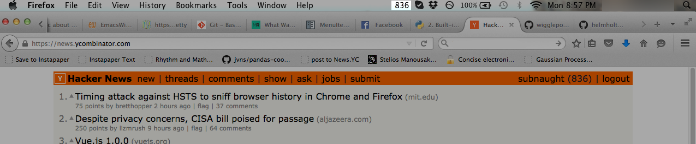

# narcissist

`narcissist` is a simple python menubar utility that monitors your Hacker News karma, so you can focus on other things. Requires rumps (https://github.com/jaredks/rumps). OS X only.

## Usage

Set `USERID` and `POLL_INTERVAL` as desired. Run `python main.py &`.
